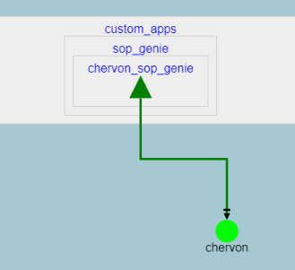
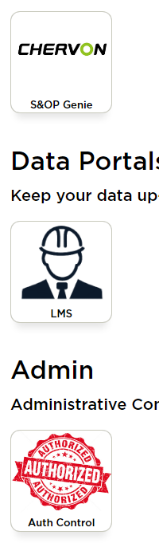

# dash_base_app

## Environment setup

In a clean conda env, preferably python==3.10.12, run the following sequence of commands.

```bash
cd /place/where/codebase/lives
# Make sure to git pull the latest codebase to your machine, and then:
python3 -m pip install -e ./codebase # you may need to navigate to where your codebase is located.
pip install -r requirements.txt
pip install Jinja2==2.11.3 # This will cause a pip conflict with Prefect -- it seems to not cause issue, however.

# These below steps were needed for Trever... they may or may not always be necesary
# pip uninstall antlr4-python3-runtime-4.11.1
# pip install antlr4-python3-runtime-4.9.3
```
## Booting the app

```bash
python app.py
```

## Development Process
1. Make a new git repo. Prefix it with 'dash_' for easy identification.
2. Ensure that Kenco-DaVinci has access to the repo in GitHub.
2. Copy paste all non git related files in this repo into your new repo.
3. Ensure you can boot the app from the new repo.
4. Configure any TODOs in serving.py and app.py for high-level naming config.
5. Local development
6. Dev deployment
7. Prod deployment

## Deployment

Once the app is in a developed state, a dev deployment can be configured. This will be launched within the dev ec2 fleet dictated by dash_home/cloud_infra/cloud_script.py, while allows for specifications of the dedicated ec2 for the app. These specs cover most of the standard needs for a simple dash app - but more complicated configuration can be handled via the User Data input on the ec2 - essentially a bootstrapping script that we are free to do anything with.

Consult with either Matthew or Amit on the config/deployment when needed.

Below is a sample configuration for the LMS portal with annotations.

```python
CONFIG =  {
    ...
    "LMSPortal":{
        'git_repo_path': "dash_lms_data_portal",  # name of your git repo - it will be auto pulled on ec2 launch
        'dev_branch': 'fixingStyling', # name of your dev/test branch you are currently working on
        'codebase_branch': 'main', # name of the codebase_branch to point at. When codebase updates it can be useful to point this at different branches, especially for testing.
        'app_dir': HOME + 'dash_lms_data_portal', # path to your git repo on the ec2. This should generally match your git_repo_path plus a home prefix.
        'conda_env': 'prod', # conda env to activate to run app.py on ec2.
        'url_path': '/portal_lms/', # url that the app will be available at. Make sure this matches serving.py
        'dev_instance': 't2.micro', # instance size
        'prod_instance': 't2.micro', # instance size
        "Dev": 'ami-03742def5919b8497', # instance AMI (has dev-doppler key baked in)
        "Prod": 'ami-025f0ba7e1518878c', # instance AMI (has prod-doppler key)
        "dev_priority": 103, # Load balancer prioritization (make sure this is a distinct int across all other apps specified and in the range (101, 199))
        "prod_priority": 303,# Load balancer prioritization (make sure this is a distinct int across all other apps specified and in the range (301, 399))
        'email_to': ['matthew.campbell@kencogroup.com', 'amit.kasera@kencogroup.com'], # Who should get email alerts if the site is unreachable?
        'prod_ready': True, # Is this app ready for prod?
    },
    ...
}

```

The cloud_script.py file can be run with a prod or dev flag, and will apply updates or recreate the stack altogether. Again, consult with Matthew/Amit to work through this process a couple times before doing it solo.

## Security Groups
Based on the name given to the app in app.py, you can create security around it via Cognito groups. 


For example, the above means that the 'chervon' Cognito group is a requirement to access the Chervon S&OP Genie. An app can have multiple requirements, and all requirements must be met for access (superuser and dev groups can overrule this).

A new 'app' object in the above graph will need to be constructed. Consult Matthew on this for the time being - self-service options will be available in the future. Edges/requirements/user-groups can be added/assigned by someone with admin permissions in Davinci-Labs.

## App link
A new link must be created in the home page of DaVinci-Labs. For the time being, consult Matthew for this step. Have a square .png prepared as a logo, and plan for the bottom section being overlaid with text like so:



## Prod updates
The steps in the deployment above won't always deploy a new ec2. If none of the ec2 config gets updates (i.e., only git repo changed), then the old ec2 with old code will remain.

The best routine to ensure zero downtime is as follows:
    1. Wait for the cloud_script.py execution to finish. You can check this in AWS cloudformation.
    2. Navigate to the associated Auto-Scaling Group (ASG) for your app.
    3. Increase the desired instances from 1 to 2. This will boot a new ec2 instance for your app.
    4. Wait for the app target group (in the load balancer section of AWS) to show 2 healthy ec2 instances. Give this step at least 15 mins. If the target is still unhealthy after this, abort and debug.
    5. Determine the OLD ec2 instance (based on launch datetimes on ec2 attributes) and deregister this one from the target group. This will leave the new, updated ec2 as the only target to route to.
    6. After the old ec2 is DRAINED, navigate to the app on your browser to ensure it is functioning as expected and updated. If anything has gone wrong, quickly re-register the old instance and deregister the new instance.
    7. Assuming all is well, you can decrement the ASG back down to 1 desired instance. This will kill the old instance by default.
    8. Your app is now deployed - ideally with zero service downtime assuming all the above steps are followed precautiously.